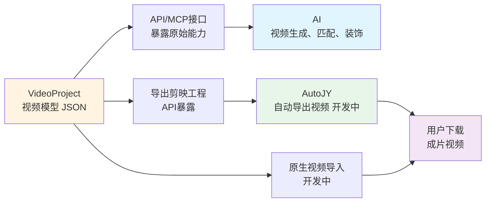

# Duo-Video

[](https://www.oracle.com/java/)
[](https://spring.io/projects/spring-boot)
[](https://maven.apache.org/)

Duo-Video 是一个强大的 Java 视频编辑 SDK，通过简洁优雅的 API 以编程方式生成专业级视频项目。项目采用分层架构设计，目前通过生成剪映工程文件实现视频创作，**最终目标是实现纯 Linux 环境下的 Headless 视频生成能力**。


（本工程由 com.duoec.video.jy.JianyingBuilderTest.buildWithProjectJson 测试用例生成）


## 项目愿景

**duo-video-base** 定义了一套简洁而完整的视频数据模型 （参考：duo-video-jy/src/test/resources/001_base_project.json），用最小化的结构描述复杂的完整视频项目。
<br>
当前阶段通过 **duo-video-jy** 模块将这套模型转换为剪映草稿，利用剪映编辑器导出最终视频。未来将直接调用底层渲染引擎，实现无需 剪映 的服务器端视频生成。

### 完整工作流程




## 项目亮点

- **支持剪映最新版本** - 与剪映专业版保持同步，支持最新特性
- **文本模板** - 丰富的官方文字动画模板，一键应用动态效果
- **画面特效** - 粒子、扭曲、模糊等数百种视觉效果
- **脸部特效** - 基于 AI 的人脸识别特效（美颜、搞怪等）
- **绿幕抠图** - 智能色度键控，支持背景替换和边缘优化
- **转场效果** - 专业的场景过渡动画
- **复合片段** - 多层素材智能合成（绿幕+背景自动合并）
- **视频倒放** - 基于 FFmpeg 的高质量倒放处理。支持剪映自带的水平镜像、垂直镜像
- **LUT 滤镜** - 专业级调色，支持肤色保护（使用自定义CUBE文件）
- **花字系统** - 花字文字效果，支持逐字符样式定制
- **Fluent API** - 流畅的 Builder 模式，代码即视频脚本


## 核心功能一览

### 基础素材（6 种）

| 素材类型     | 功能描述     | 特性              |
|----------|----------|-----------------|
| **视频**   | 支持常见视频格式 | 时间裁剪、变速、倒放      |
| **图片**   | 支持常见图片格式 | 自定义显示时长、缩放      |
| **文本**   | 富文本编辑    | 多样式、花字、描边、阴影、背景 |
| **字幕**   | 基于文本系统   | 继承全部文本样式能力      |
| **音频**   | 背景音乐、配音  | 时间范围、音量控制       |
| **文本模板** | 官方动画模板   | 多文本块、动态效果       |
| -- 其它 -- | 新功能持续追加中 | ...             |

### 特效素材（5 种）

| 特效类型 | 功能描述 | 应用场景 |
|---------|---------|---------|
| **特效音** | 短音效资源 | 转场音、点击音、环境音 |
| **贴纸** | 动态或静态贴纸 | 表情、标签、装饰 |
| **转场** | 场景过渡动画 | 淡入淡出、擦除、翻转等 |
| **画面特效** | 全屏视觉效果 | 粒子、扭曲、色彩调整 |
| **脸部特效** | AI 人脸特效 | 美颜、搞怪、风格化 |

（素材资源API、界面正在开发中... ）


### 高级功能（14 项）

- **绿幕抠图** - 智能 Chroma Key，支持自定义取色和容差
- **复合片段** - 绿幕视频与背景自动合成为 Group
- **视频倒放** - FFmpeg 驱动的高质量倒放
- **文本模板** - 全网唯一完整支持剪映文本模板
- **逐字样式** - 单个字符独立样式（颜色、大小、特效）


## 项目架构

```
duo-video/
├── duo-server-base/      # 基础工具库（文件处理、JSON、工具类）
├── duo-video-base/       # 核心数据模型（VideoProject、Material、Segment）
└── duo-video-jy/         # 剪映集成（将数据模型转换为剪映工程格式）
    ├── builder/          # 17 个专业 Builder 类
    ├── dto/              # 剪映数据结构映射
    └── service/          # 素材下载、FFmpeg、Exiftool 集成
```


## 核心概念

### 三层数据模型

```
VideoProject (视频项目)
├── projectName: 项目名称
├── width/height: 分辨率
├── fps: 帧率
├── scripts: List<VideoScript> (分镜列表，用于组织复杂的项目)
│   └── VideoScript (分镜)
│       ├── time: 时间范围（可选，未填写时自动扩容）
│       └── segments: List<VideoSegment> (片段列表)
│           └── VideoSegment (片段)
│               ├── materialId: 关联的素材ID
│               ├── type: 素材类型
│               ├── time: 显示时间范围
│               ├── speed: 变速
│               ├── zoom: 缩放
│               ├── point: 位置
│               ├── rotate: 旋转
│               ├── opacity: 透明度
│               ├── volume: 音量
│               └── refs: 关联的其他素材（如转场）
└── materials: List<BaseMaterial> (素材库)
```


### 坐标系统

```
        Y+
        ↑
        |
X- ←--(0,0)--→ X+
        |
        ↓
        Y-
```

参考剪映的坐标系

- **原点 (0, 0)**: 视频画面中心
- **X 轴**: 左负右正
- **Y 轴**: 上正下负（注意：与常见坐标系相反）


### 时间单位

所有时间参数使用 **毫秒（ms）** 为单位：

- 1 秒 = 1,000 毫秒
- 3 秒 = 3,000 毫秒


### 轨道层级顺序

轨道自下而上的渲染顺序（数字越小越在底层）：

1. 特效音
2. 音频
3. 绿幕背景
4. 视频
5. 图片
6. 画面特效
7. 贴纸
8. 字幕
9. 文本
10. 文本模板


## 实用示例

### 基础视频

```json
{
  "scripts": [ // 分镜。也可以一个视频都放在一个分镜下，仅为方便管理
    "segments": [
      {
        "id": 296653948753219561,
        "time": { // 当前视频展示的
          "start": 3000, // 当前片段从第几毫秒开始，单位：毫秒
          "duration": 5000 // 当前片段持续时长，单位：毫秒
        },
        "materialId": 535010997887571046, // 引用的素材ID
        "materialStart": 10000, // 当前片段的视频从第几毫秒开始
        "type": "video",
      }
		]
  ],
  "materials": [
    {
      "id": 535010997887571046, // 全局唯一。生成剪映工程时会将它作为临时文件名，如果重复，视频引用会乱掉！
      "url": "https://api.duoec.com/public/video/535010997887571046.mov",
      "type": "video"
    }
  ]
}
```

### 

### 绿幕抠图 + 背景替换

```json
{
  "scripts": [
  	"segments": [
    	{
        "id": 296653948753219560,
        "time": {
          "start": 0,
          "duration": 3000
        },
        "materialId": 535010997887571021,
        "materialStart": 5000,
        "type": "video"
      }
		]
  ],
  "materials": [
    {
      "id": 535010997887571021, # 素材ID，是一个全局唯一的整数
      "url": "https://api.duoec.com/public/video/535010997887571021.mp4", 
      "type": "video",
      "time": { // 素材使用片段。可选，为空时表示整个视频
        "start": 0, 
        "duration": 86586
      },
      "greenBackground": { // 绿幕配置，当然也支持白幕、蓝幕。以下参数可以使用AI推荐（需要多模态支持）
        "materialId": 535010997887571022, // 绿幕素材，可以是图片、视频
        "baseBackgroundColor": "#4e8a1fff", // 绿幕颜色
        "strength": 20, // 强度。参考剪映里的 强度
        "edgeFeather": 10, // 边缘羽化。参考剪映
        "edgeCleanup": 10, // 边缘清理。参考剪映
    		"shadow": 0 // 阴影。参考剪映，旧版本不支持
      }
    },
		{ // 绿幕背景的素材
      "id": 535010997887571022,
      "url": "https://api.duoec.com/public/greenScreen/d8a0e31b50166b6219b1df1dbb90e284.png",
      "type": "image"
    }
  ]
}
```


### 复杂文本样式

```json
{
  "scripts": [
    "segments": [
    	{
          "id": 296653948753219562,
          "time": {
            "start": 10,
            "duration": 1990
          },
          "materialId": 535010997887571047,
          "materialStart": 0,
          "type": "subtitle",
          "layoutIndex": 1000,
          "refs": {},
          "speed": 100,
          "point": {
            "x": 0,
            "y": -1000
          },
          "rotate": 0
        }
		  ]
  ],
  "materials": [
    {
      "id": 535010997887571047,
      "type": "text",
      "text": "测试中文字幕",
      "textType": "subtitle",
      "style": {
        "fontSize": 14,
        "bold": false,
        "italic": false,
        "textAlign": 1,
        "fontName": "微软雅黑",
        "fillColor": "#FFFFFF",
        "strokeColor": "#FF0000",
        "strokeWidth": 10
      },
      "words": [
        {
          "index": 2,
          "length": 2,
          "fontSize": 16,
          "fillColor": "#00FFFF",
          "strokeColor": "#0000FF",
          "strokeWidth": 20
        },
        {
          "index": 3,
          "length": 2,
          "fontSize": 18,
          "fillColor": "#FFFF00",
          "backgroundColor": "#FF0000"
        }
      ]
    }
  ]
}
```


### 使用 JSON 配置

```java
// 从 JSON 文件加载项目
VideoProject project = FileUtils.readJson("001_base_project.json", VideoProject.class);

// 构建剪映工程
JianYingProjectInfo jyProject = new JianyingBuilder().build(project);
```

注意：本demo中，第一个视频旋转 90度，应该是倒着的人，但又配置了垂直镜像，所以人正过来了。剪映5.9版本不支持垂直镜像，所以在低版本上人是倒过来的。特此说明


## 特别说明

**本项目仅供学习交流使用，如有侵权，请联系作者。**


_本 README.md 由 claude code 生成，仅作参考，以代码实现为准_