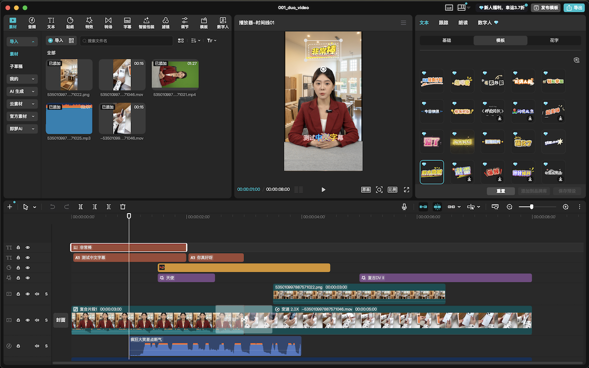
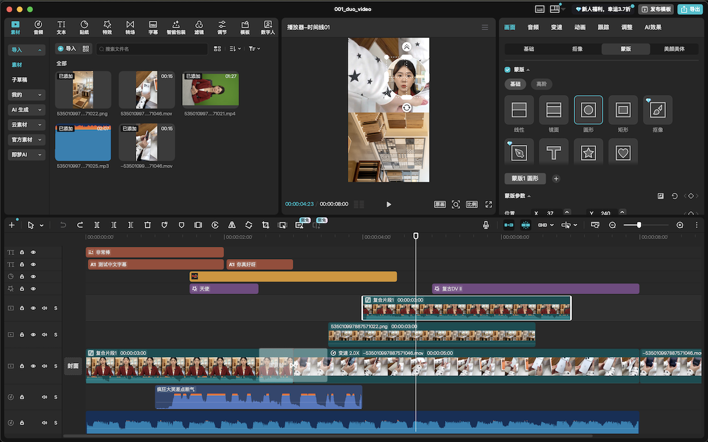
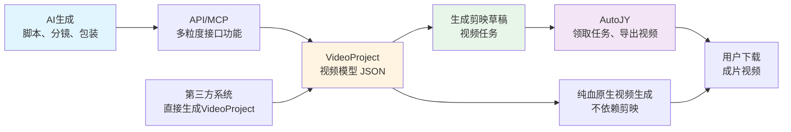

# Duo-Video

[](https://www.oracle.com/java/)
[](https://spring.io/projects/spring-boot)
[](https://maven.apache.org/)

Duo-Video 是一个强大的 Java 视频编辑 SDK，通过简洁优雅的 API 以编程方式生成专业级视频项目。项目采用分层架构设计，通过生成剪映工程文件实现视频创作



（本工程由 com.duoec.video.jy.JianyingBuilderTest.buildWithProjectJson 测试用例生成) [下载这个剪映工程](https://api.duoec.com/public/001_duo_video.zip)


## 一、项目概要

**duo-video-base** 定义了一套简洁而完整的视频数据模型 （参考：duo-video-jy/src/test/resources/001_base_project.json），用最小化的结构描述复杂的完整视频项目。


### 1.1 完整工作流程

> 以 VideoProject 视频工程文件为基础。比剪映文件更加简洁、简化了复杂的本地文件引用，一个json文件就组建起整个视频的框架
>
> 更方便AI理解，并通过MCP，供AI Agent的调用，满足AI使用场景


```mermaid
graph LR
    A[AI生成<br/>脚本、分镜、包装] --> B[API/MCP<br/>多粒度接口功能]
    B --> C[VideoProject<br/>视频模型 JSON]
    D[第三方系统<br/>直接生成VideoProject] --> C
    C --> E[生成剪映草稿<br/>视频任务]
    E --> F[AutoJY<br/>领取任务、导出视频]
    F --> G[用户下载<br/>成片视频]
    C --> H[纯血原生视频生成<br/>不依赖剪映]
    H --> G

    style A fill:#e1f5ff
    style C fill:#fff4e1
    style E fill:#e8f5e9
    style F fill:#f3e5f5
```


## 1.2 项目亮点

- **支持剪映最新版本** - 与剪映专业版保持同步，支持最新特性 (验证版本：剪映 v9.6.0)
- **离线剪映草稿** - 草稿包含所有的资源，无需等待官方下载
- **文本模板** - 丰富的官方文字动画模板，一键应用动态效果 (支持 7000+文本模板)
- **画面特效** - 粒子、扭曲、模糊等数百种视觉效果 （支持 300+画面特效）
- **脸部特效** - 基于 AI 的人脸识别特效（美颜、搞怪等） （支持 600+人脸特效）
- **绿幕抠图** - 智能色度键控，支持背景替换和边缘优化 
- **蒙板** - 人脸的精确控制浮动展示（人脸的计算有点复杂，需要配合小模型进行人脸识别才做得好）
- **转场效果** - 专业的场景过渡动画 （支持 700+种转场特效）
- **复合片段** - 多层素材智能合成（绿幕+背景自动合并）
- **视频倒放** - 基于 FFmpeg 的倒放处理。支持剪映自带的水平镜像、垂直镜像
- **LUT 滤镜** - 专业级调色，支持肤色保护（使用自定义CUBE文件，剪映LUT属性展示不出来，等剪映的修复）
- **花字系统** - 花字文字效果，支持逐字符样式定制 （支持 2000+花字）
- **文本预设样式** - 文本预设样式，简化配置，支持剪映划词高亮


- **剪映自动导出** - 可通过多机部署支持大批量视频生产（目前支持 [MacOS版](auto-jy/auto-jy-mac/README.md)，Windows版本可以生成中...）


## 二、核心功能一览

### 2.1 基础素材（6 种）

| 素材类型     | 功能描述     | 特性              |
|----------|----------|-----------------|
| **视频**   | 支持常见视频格式 | 时间裁剪、变速、倒放      |
| **图片**   | 支持常见图片格式 | 自定义显示时长、缩放      |
| **文本**   | 富文本编辑    | 多样式、花字、描边、阴影、背景 |
| **字幕**   | 基于文本系统   | 继承全部文本样式能力      |
| **音频**   | 背景音乐、配音  | 时间范围、音量控制       |
| **文本模板** | 官方动画模板   | 多文本块、动态效果       |
| -- 其它 -- | 新功能持续追加中 | ...             |

### 2.2 特效素材（6 种）

| 特效类型 | 功能描述 | 应用场景 | 资源数量 |
|---------|---------|---------|---------|
| **特效音** | 短音效资源 | 转场音、点击音、环境音 | 875 |
| **贴纸** | 动态或静态贴纸 | 表情、标签、装饰 | 5356 |
| **转场** | 场景过渡动画 | 淡入淡出、擦除、翻转等 | 774 |
| **画面特效** | 全屏视觉效果 | 粒子、扭曲、色彩调整 | 1538 |
| **脸部特效** | AI 人脸特效 | 美颜、搞怪、风格化 | 310 |

剪映资源浏览：[https://www.duoec.com/video](https://www.duoec.com/video) 


### 2.3 高级功能（6 项）

- **绿幕抠图** - 智能 Chroma Key，支持自定义取色和容差
- **复合片段** - 绿幕视频与背景自动合成为 Group
- **视频倒放** - FFmpeg 驱动的高质量倒放
- **文本模板** - 全网唯一完整支持剪映文本模板，支持多段落文本
- **逐字样式** - 单个字符独立样式（颜色、大小、特效）
- **蒙板** - 可精确控制人脸位置、大小、浮动位置


点击浏览：[https://www.duoec.com/video](https://www.duoec.com/video) 点击资源图片，自动复制资源ID到粘贴板


## 三、项目架构

```
duo-video/
├── auto-jy/					    # 自动剪映工具（视频任务自动领取、生成、上报）
│   └── auto-jy-mac/      # MAC版自动剪映工具（Windows版AI正在疯狂生产中）
├── duo-server-base/      # 基础工具库（文件处理、JSON、工具类）
├── duo-video-base/       # 核心数据模型（VideoProject、Material、Segment）
├── duo-video-jy/         # 剪映集成（将数据模型转换为剪映工程格式）
│   ├── builder/          # 17 个专业 Builder 类
│   ├── dto/              # 剪映数据结构映射
│   └── service/          # 素材下载、FFmpeg、Exiftool 集成
└── duo-video-api/        # RESTful API 接口（视频生产接口、视频任务接口）
    ├── controller/       # HTTP 接口控制器
    ├── dto/              # 请求/响应数据传输对象
    └── server/           # 业务服务层
```


## 四、核心概念

### 4.1 三层数据模型

```
VideoProject (视频项目)
├── projectName: 项目名称
├── width/height: 分辨率
├── fps: 帧率
├── scripts: List<VideoScript> (分镜列表，用于组织复杂的项目)
│   └── VideoScript (分镜)
│       ├── time: 时间范围（可选，未填写时自动扩容）
│       └── segments: List<VideoSegment> (片段列表)
│           └── VideoSegment (片段)
│               ├── materialId: 关联的素材ID
│               ├── type: 素材类型
│               ├── time: 显示时间范围
│               ├── speed: 变速
│               ├── zoom: 缩放
│               ├── point: 位置
│               ├── rotate: 旋转
│               ├── opacity: 透明度
│               ├── volume: 音量
│               └── refs: 关联的其他素材（如转场）
└── materials: List<BaseMaterial> (素材库)
```


### 4.2 坐标系统

```
        Y+
        ↑
        |
X- ←--(0,0)--→ X+
        |
        ↓
        Y-
```

参考剪映的坐标系

- **原点 (0, 0)**: 视频画面中心
- **X 轴**: 左负右正
- **Y 轴**: 上正下负（注意：与常见坐标系相反）


### 4.3 时间单位

所有时间参数使用 **毫秒（ms）** 为单位：

- 1 秒 = 1,000 毫秒
- 3 秒 = 3,000 毫秒


### 4.4 旋转方向

- 正: 顺时针 
- 负: 逆时针


### 4.5 轨道层级顺序

轨道自下而上的渲染顺序（数字越小越在底层）：

1. 特效音
2. 音频
3. 绿幕背景
4. 视频
5. 图片
6. 蒙板
7. 画面特效
8. 贴纸
9. 字幕
10. 文本
11. 文本模板


## 五、实用示例

### 5.1 基础视频

```json
{
    "scripts": [ // 分镜。也可以一个视频都放在一个分镜下，仅为方便管理
        {
            "segments": [
                {
                    "id": 296653948753219561,
                    "time": { // 当前视频展示的
                        "start": 3000, // 当前片段从第几毫秒开始，单位：毫秒
                        "duration": 5000 // 当前片段持续时长，单位：毫秒
                    },
                    "materialId": 535010997887571046, // 引用的素材ID
                    "materialStart": 10000, // 当前片段的视频从第几毫秒开始
                    "type": "video"
                }
            ]
        }
    ],
    "materials": [
        {
            "id": 535010997887571046, // 全局唯一。生成剪映工程时会将它作为临时文件名，如果重复，视频引用会乱掉！
            "url": "https://api.duoec.com/public/video/535010997887571046.mov",
            "type": "video"
        }
    ]
}
```


### 5.2 绿幕抠图 + 背景替换

```json
{
    "scripts": [
        {
            "segments": [
                {
                    "id": 296653948753219560,
                    "time": {
                        "start": 0,
                        "duration": 3000
                    },
                    "materialId": 535010997887571021,
                    "materialStart": 5000,
                    "type": "video"
                }
            ]
        }
    ],
    "materials": [
        {
            "id": 535010997887571021, // 素材ID，是一个全局唯一的整数
            "url": "https://api.duoec.com/public/video/535010997887571021.mp4",
            "type": "video",
            "time": { // 素材使用片段。可选，为空时表示整个视频
                "start": 0,
                "duration": 86586
            },
            "greenBackground": { // 绿幕配置，当然也支持白幕、蓝幕。以下参数可以使用AI推荐（需要多模态支持）
                "materialId": 535010997887571022, // 绿幕素材，可以是图片、视频
                "baseBackgroundColor": "#4e8a1fff", // 绿幕颜色
                "strength": 20, // 强度。参考剪映里的 强度
                "edgeFeather": 10, // 边缘羽化。参考剪映
                "edgeCleanup": 10, // 边缘清理。参考剪映
                "shadow": 0 // 阴影。参考剪映，旧版本不支持
            }
        },
        { // 绿幕背景的素材
            "id": 535010997887571022,
            "url": "https://api.duoec.com/public/greenScreen/d8a0e31b50166b6219b1df1dbb90e284.png",
            "type": "image"
        }
    ]
}
```


### 5.3 复合片段 + 圆形蒙板

```json
{
    "scripts": [
        {
            "segments": [
                {
                    "id": 296653948753219564,
                    "time": {
                        "start": 4000,
                        "duration": 3000
                    },
                    "materialId": 535010997887571021, // 注意，多次复用时，会复用第一次出现时的构建复合片段
                    "materialStart": 9000,
                    "type": "video",
                    "refs": {
                        "296653948753219539": "mask"
                    }
                }
            ]
        }
    ],
    "materials": [
        {
            "id": 535010997887571021, // 素材ID，是一个全局唯一的整数
            "url": "https://api.duoec.com/public/video/535010997887571021.mp4",
            "type": "video",
            "time": { // 素材使用片段。可选，为空时表示整个视频
                "start": 0,
                "duration": 86586
            },
            "greenBackground": { // 绿幕配置，当然也支持白幕、蓝幕。以下参数可以使用AI推荐（需要多模态支持）
                "materialId": 535010997887571022, // 绿幕素材，可以是图片、视频
                "baseBackgroundColor": "#4e8a1fff", // 绿幕颜色
                "strength": 20, // 强度。参考剪映里的 强度
                "edgeFeather": 10, // 边缘羽化。参考剪映
                "edgeCleanup": 10, // 边缘清理。参考剪映
                "shadow": 0 // 阴影。参考剪映，旧版本不支持
            }
        },
        { // 绿幕背景的素材
            "id": 535010997887571022,
            "url": "https://api.duoec.com/public/greenScreen/d8a0e31b50166b6219b1df1dbb90e284.png",
            "type": "image"
        },
        {
            "id": 296653948753219539,
            "resourceId": 270415264124764161, // 蒙板-圆形的资源ID
            "type": "mask",
            "config": { // 以下是蒙板的配置，有点复杂，需要配合人脸识别小模型才能完成程序自动生成。这一部分可能还会进行优化
                "width": 0.5, // 蒙板宽度比例（与视频宽的比值）
                "height": 0.28, // 蒙板高度比例（与视频高的比值）
                "centerX": 0.07, // 蒙板中心位置X轴（与视频宽的比值，有点奇葩）
                "centerY": 0.25, // 蒙板中心位置Y轴（与视频高的比值，有点奇葩）
                "pointX": 400, // 蒙板视频的位移X轴，与剪映界面值一致
                "pointY": 400 // 蒙板视频的位移Y轴，与剪映界面值一致
            }
        }
    ]
}
```


### 5.4 复杂文本样式

```json
{
    "scripts": [
        {
            "segments": [
                {
                    "id": 296653948753219562,
                    "time": {
                        "start": 10,
                        "duration": 1990
                    },
                    "materialId": 535010997887571047,
                    "materialStart": 0,
                    "type": "subtitle",
                    "layoutIndex": 1000,
                    "refs": {},
                    "speed": 100,
                    "point": {
                        "x": 0,
                        "y": -1000
                    },
                    "rotate": 0
                }
            ]
        }
    ],
    "materials": [
        {
            "id": 535010997887571047,
            "type": "text",
            "text": "测试中文字幕",
            "textType": "subtitle",
            "style": {
                "fontSize": 14,
                "bold": false,
                "italic": false,
                "textAlign": 1,
                "fontName": "微软雅黑",
                "fillColor": "#FFFFFF",
                "strokeColor": "#FF0000",
                "strokeWidth": 10
            },
            "words": [
                {
                    "index": 2,
                    "length": 2,
                    "fontSize": 16,
                    "fillColor": "#00FFFF",
                    "strokeColor": "#0000FF",
                    "strokeWidth": 20
                },
                {
                    "index": 3,
                    "length": 2,
                    "fontSize": 18,
                    "fillColor": "#FFFF00",
                    "backgroundColor": "#FF0000"
                }
            ]
        }
    ]
}
```


### 5.5 文本预设样式

> 实现预设样式，可以在需要使用的地方简单使用 styleId引用即可，还支持预设样式的覆盖

``` json
{
    "scripts": [
        {
            "segments": [
                {
                    "id": 535010997887571047,
                    "type": "text",
                    "text": "测试中文字幕",
                    "textType": "subtitle",
                    "styleId": 296653948753219540, // 可以直接引用文本样式，以简化样式定义
                    "style": {
                      "fontSize": 14 // 可以覆盖样式，仅覆盖当前样式，不会污染预设样式
                    },
                    "words": [
                        {
                            "index": 2,
                            "length": 2,
                            "fontSize": 16,
                            "fillColor": "#00FFFF",
                            "strokeColor": "#0000FF",
                            "strokeWidth": 20
                        },
                        {
                            "index": 3,
                            "length": 2,
                            "styleId": 296653948753219540, // 文本片段样式也可以直接引用样式
                            "fontSize": 18 // 在引用的样式之后，可以覆盖样式
                        }
                    ]
                }
            ]
        }
    ],
    "materials": [
        { // 定义一个样式表
            "id": 296653948753219540,
            "type": "style",
            "globalKeywordStyle": true, // 设置为全局关键字样式，作为剪映的划词默认样式，此样式全局仅存在一个为true
            "style": {
                "fontSize": 28,
                "bold": true,
                "italic": true,
                "textAlign": 1,
                "fontName": "抖音美好体",
                "fillColor": "#FFFF00",
                "strokeColor": "#FF0000",
                "strokeWidth": 10
            }
        }
    ]
}
```


### 5.6 文本模板

```json
{
    "scripts": [
        {
            "segments": [
                {
                    "id": 296653948753219503,
                    "time": {
                        "start": 0,
                        "duration": 2000
                    },
                    "materialId": 535010997887571000,
                    "type": "text",
                    "zoom": { // 文本模板的缩放
                        "x": 5000, // 单位：万分之几，5000即 50%
                        "y": 5000
                    },
                    "point": { // 文本模板位置，与剪映一致
                        "x": 0,
                        "y": 1400
                    }
                }
            ]
        }
    ],
    "materials": [
        {
            "id": 535010997887571000,
            "type": "text_template", // 类型
            "texts": [ // 内容，需要与文本模板匹配
                "非常棒"
            ],
            "resourceId": 270464050694389761 // 文本模板资源ID，可以到 https://www.duoec.com/video 上查询
        }
    ]
}
```


### 5.7 创建复合片段

```java
/**
 * 合并为复合片段
 * 将已经添加进 剪映草稿 的多段片段抽取成复合片段。程序将会自动迁移指定片段依赖的materials一并迁移到复合片段内
 * 跟在剪映上直接合并复合片段是一样的效果
 * @param projectInfo 工程
 * @param segments 需要合并的segments
 */
com.duoec.video.jy.utils.JianyingUtils.combine(JianYingProjectInfo projectInfo, List<Segment> segments);
```


## 六、快速上手

### 6.1 环境准备

duo-video 运行在 JDK21 + maven上，请自行配置运行环境


#### ffmpeg

项目依赖 [ffmpeg](https://www.ffmpeg.org/download.html) ，需要提前安装好


#### 剪映草稿目录配置

git clone下来之后，请改一下你的 剪映草稿目录，打开：com.duoec.video.jy.BaseTest.java，修改下面一行代码为你本地的正确地址

```java
// 测试代码会直接将剪映工程生成到这个目录下，如果配置的是剪映的草稿目录，就可以直接打开剪映看到
JianyingProjectBuildState.DEBUG_JY_DRAFT_DIR = "/Users/xuwenzhen/Movies/JianyingPro/User Data/Projects/com.lveditor.draft/";
```


#### secret 配置（可选）

如果你已经注册且分配了 secretKey，请在环境变量里配置。如果没有配置，只能使用公开的资源

| 环境变量       | 说明                    | 备注         |
| -------------- | ----------------------- | ------------ |
| DUO_SECRET_ID  | 接口签名加密 SECRET_ID  |              |
| DUO_SECRET_KEY | 接口签名加密 SECRET_KEY |              |
| DUO_SERVER     | 资源服务器地址          | 默认无需设置 |


#### 缓存目录（可选）

默认情况下，程序会在创建缓存目录 duo-video-jy/tmp，这些文件可以随时安全删除。如果遇到一些奇怪的错误，也可以尝试删除此目录，清掉缓存文件。


### 6.2 直接使用使用 JSON 配置

```java
// 从 JSON 文件加载项目，001_base_project.json文件在项目资源目录duo-video-jy/src/test/resources 里面
VideoProject project = FileUtils.readJson("001_base_project.json", VideoProject.class);

// 构建剪映工程
JianYingProjectInfo jyProject = new JianyingBuilder().build(project);
```

注意：本demo中，第一个视频旋转 90度，应该是倒着的人，但又配置了垂直镜像，所以人正过来了。剪映5.9版本不支持垂直镜像，所以在低版本上人是倒过来的。特此说明


### 6.3 使用VideoBuilder构建 -- 链式调用

``` java
long textTemplateResourceId = 270464050694389761L;
VideoProject videoProject = ProjectBuilder.createBuilder(SnowflakeIdUtils.nextTmpId(), "测试", 1080, 1920)
  .setTest(true) // 设置为测试模式

  .getScriptBuilder(0) // 进入第一个分镜
  .addTextTemplateAndGetBuilder(textTemplateResourceId, "太好了", 0, 3000) // 添加一个文本模板
  .setPosition(0, -400) // 指定展示位置，0，0表示视频中央 上正下负 左负右正
  .back() // 返回到 ProjectScriptBuilder

  .addTextAndGetBuilder(String.valueOf(textTemplateResourceId), 0, 3000)
  .setStyle(
          new TextStyle()
                  .setFontSize(5)
                  .setTextAlign(1)
                  .setFillColor(JianyingResourceUtils.DEFAULT_FILL_COLOR)
                  .setFontName(JianyingResourceUtils.DEFAULT_FONT_NAME)
  )
  .setPosition(0, 1866)
  .back()// 返回到 ProjectScriptBuilder

  .back()// 返回到 ProjectBuilder
  .getProject(); // 导出工程

JianYingProjectInfo jyProject = jianyingBuilder.build(videoProject); // 直接生成 剪映草稿
```


### 6.4 使用VideoBuilder构建 -- 函数式

``` java
VideoProject project = ProjectBuilder.createBuilder(SnowflakeIdUtils.nextTmpId(), "测试", 1080, 1920)
    .build(projectBuilder -> {
        // ProjectVideo 上下文，可以在这里修改 ProjectVideo 信息
        // projectBuilder.setTest(true);
    })
    .setTest(true)
    .buildGlobalStyle(296653948753219540L, new TextStyle(), styleBuilder -> {
        // 进入 ProjectTextStyleBuilder 上下文，在这里可以编辑当前预设样式
    })
    .buildScript(0, scriptBuilder -> {
        // 在第一个分镜下
        // scriptBuilder.getVideoBuilder().setUpend(true); //虽然在分镜的上下文环境里也可以获得上层的builder，但不建议在此修改、处理分镜外的数据！！
        scriptBuilder
                .build(videoScriptBuilder -> {
                    // ProjectVideoScript 上下文，可以在这里修改 ProjectVideoScript 信息（当然，看上去有点多此一举，看你喜欢）
                    // videoScriptBuilder.setTime(0L, 3000L);
                })
                .buildNewVideo(535010997887571046L, "https://api.duoec.com/public/video/535010997887571046.mov", 0, 3000, videoBuilder -> {
                    // 进入 ProjectVideoBuilder，可以在这里修改 ProjectVideo 的信息
                    videoBuilder
                            // .setPosition(0, -400) // 指定展示位置，0，0表示视频中央 上正下负 左负右正
                            .setSpeed(50) // x0.5倍速播放
                    ;
                }) // 添加一个视频
                .buildNewTextTemplate(270464050694389761L, List.of("太好了"), 0, 3000, textTemplateBuilder -> {
                    // 进入 ProjectScriptBuilder 上下文。在这里可以处理当前新添加的文本模板信息
                })
                .buildNewSticker(270402997699280897L, 1500L, 3000L, stickerBuilder -> {
                    // 进入 ProjectStickerBuilder 上下文。这里可以处理当前新添加的贴纸信息
                })
                .builderNewVideoEffect(270464037793497089L, 5000L, 3000L, videoEffectBuilder -> {
                    // 进入 ProjectVideoEffectBuilder 上下文。这里可以处理当前新添加的 画面特效 信息
                })
                .buildNewFaceEffect(270464033541718017L, 1500L, 1000L, faceEffectBuilder -> {
                    // 进入 ProjectFaceEffectBuilder 上下文。这里可以处理当前新添加的 脸部特效 信息
                })
                .buildNewSound(270464042140893185L, 1000L, 3000L, soundBuilder -> {
                    // 进入 ProjectSoundBuilder 上下文，这里可以处理当前新添加的 特效音 信息
                })
                .buildNewText("你真好呀", 2001L, 999L, textBuilder -> {
                    // 进入 ProjectTextBuilder 上下文，这里可以处理当前新添加的 文本 信息
                    textBuilder
                            .setPosition(0, -800)
                            .setStyle(
                                    new TextStyle()
                                            .setFontSize(14)
                                            .setFillColor("#FF0000")
                            )
                    ;
                })
        ;
    })
    .getProject();

JianYingProjectInfo jyProject = jianyingBuilder.build(videoProject); // 直接生成 剪映草稿
```

详见：com.duoec.video.jy.JianyingBuilderTest.buildWithBuilder() 完整实现了 001_base_project.json 的所有能力


### 6.5 使用 RESTful API 接口

duo-video-api 提供了完整的 RESTful API 接口，支持通过 HTTP 请求创建和编辑视频项目。

#### 6.5.1 启动 API 服务

```bash
# 进入 API 模块目录
cd duo-video-api

# 启动 Spring Boot 应用
mvn spring-boot:run
```

服务默认运行在 `http://localhost:8080`

#### 6.5.2 API 接口列表

所有接口统一返回格式：
```json
{
  "code": 0,           // 0 表示成功，非 0 表示失败
  "message": "success",
  "data": { ... }      // VideoProject 对象
}
```

##### 1. 创建视频项目

```bash
POST /api/video
Content-Type: application/json

{
  "projectId": 123456789,      // 可选，不传则自动生成
  "projectName": "我的视频",    // 可选，默认使用 projectId
  "width": 1080,               // 可选，默认 1080
  "height": 1920,              // 可选，默认 1920
  "test": true                 // 可选，是否为测试模式
}
```

##### 2. 设置全局文本样式

```bash
POST /api/video/global-style
Content-Type: application/json

{
  "projectId": 123456789,
  "styleId": 296653948753219540,
  "textStyle": {
    "fontSize": 28,
    "bold": true,
    "italic": true,
    "textAlign": 1,
    "fontName": "抖音美好体",
    "fillColor": "#FFFF00",
    "strokeColor": "#FF0000",
    "strokeWidth": 10
  },
  "globalKeywordStyle": true    // 是否设为全局关键词样式
}
```

##### 3. 添加图片素材

```bash
POST /api/video/image
Content-Type: application/json

{
  "projectId": 123456789,
  "scriptIndex": 0,             // 分镜索引，默认 0
  "imageId": 535010997887571096,
  "imageUrl": "https://example.com/image.png",
  "startTime": 3500,            // 开始时间（毫秒）
  "duration": 3000,             // 持续时间（毫秒）
  "layoutIndex": 1000,          // 图层索引
  "zoomX": 7500,                // X 轴缩放（万分比）
  "zoomY": 7500,                // Y 轴缩放（万分比）
  "positionX": 0,               // X 轴位置
  "positionY": -1512,           // Y 轴位置
  "rotate": -90,                // 旋转角度
  "visible": true,              // 是否可见
  "horizontal": true,           // 水平翻转
  "vertical": true              // 垂直翻转
}
```

##### 4. 添加视频素材（支持绿幕和蒙版）

```bash
POST /api/video/video
Content-Type: application/json

{
  "projectId": 123456789,
  "scriptIndex": 0,
  "videoId": 535010997887571021,
  "videoUrl": "https://example.com/video.mp4",
  "startTime": 0,
  "duration": 3000,
  "materialStart": 5000,        // 素材开始位置（毫秒）
  "materialTimeStart": 0,       // 素材时间范围开始（毫秒）
  "materialTimeEnd": 14264,     // 素材时间范围结束（毫秒）
  "layoutIndex": 1000,
  "speed": 100,                 // 播放速度（百分比）
  "zoomX": 10000,
  "zoomY": 10000,
  "rotate": 90,
  "visible": true,
  "horizontal": true,
  "volume": 0,                  // 音量（-100 到 100）
  "transitionId": 270404457990455297,  // 转场特效 ID
  "transitionDuration": 1000,          // 转场持续时间
  "greenBackground": {          // 绿幕背景（可选）
    "greenScreenId": 535010997887571022,
    "greenScreenUrl": "https://example.com/green.png",
    "chromaColor": "#4e8a1fff",
    "chromaStrength": 20,
    "chromaShadow": 10,
    "chromaHighlight": 10
  },
  "mask": {                     // 蒙版（可选）
    "maskId": 270415264124764161,
    "feather": 5,
    "rotation": 90,
    "width": 0.5,
    "height": 0.28,
    "centerX": 0.07,
    "centerY": 0.25,
    "pointX": 400,
    "pointY": 400
  }
}
```

##### 5. 添加音频素材

```bash
POST /api/video/audio
Content-Type: application/json

{
  "projectId": 123456789,
  "scriptIndex": 0,
  "audioId": 535010997887571025,
  "audioUrl": "https://example.com/audio.mp3",
  "startTime": 0,
  "duration": 8000,
  "materialTimeStart": 170,
  "materialTimeEnd": 126869,
  "materialStart": 10000,
  "layoutIndex": 1000,
  "speed": 100,
  "visible": true,
  "volume": -50
}
```

##### 6. 添加文本/字幕

```bash
POST /api/video/text
Content-Type: application/json

{
  "projectId": 123456789,
  "scriptIndex": 0,
  "text": "测试中文字幕",
  "startTime": 10,
  "duration": 1990,
  "layoutIndex": 1000,
  "positionX": 0,
  "positionY": -1000,
  "rotate": 0,
  "asSubtitle": true,           // 是否作为字幕
  "styleId": 296653948753219540, // 引用全局样式 ID（可选）
  "style": {                    // 自定义样式（可选）
    "fontSize": 14,
    "bold": false,
    "italic": false,
    "textAlign": 1,
    "fontName": "微软雅黑",
    "fillColor": "#FFFFFF",
    "strokeColor": "#FF0000",
    "strokeWidth": 10
  },
  "wordStyles": [               // 逐字样式（可选）
    {
      "startIndex": 2,
      "length": 2,
      "fontSize": 16,
      "fillColor": "#00FFFF",
      "strokeWidth": 20,
      "strokeColor": "#0000FF"
    },
    {
      "startIndex": 3,
      "length": 2,
      "styleId": 296653948753219540,
      "fontSize": 18,
      "flowerId": 270413717936603137  // 花字 ID
    }
  ]
}
```

##### 7. 添加文本模板

```bash
POST /api/video/text-template
Content-Type: application/json

{
  "projectId": 123456789,
  "scriptIndex": 0,
  "templateId": 270414005699805185,
  "texts": ["非", "常", "棒", "duoec.com"],
  "startTime": 2001,
  "duration": 999,
  "layoutIndex": 1000,
  "zoomX": 5000,
  "zoomY": 5000,
  "positionX": 0,
  "positionY": 1400
}
```

##### 8. 添加贴纸

```bash
POST /api/video/sticker
Content-Type: application/json

{
  "projectId": 123456789,
  "scriptIndex": 0,
  "stickerId": 270402997699280897,
  "startTime": 1500,
  "duration": 3000,
  "zoomX": 5000,
  "zoomY": 5000,
  "positionX": 500,
  "positionY": 0,
  "rotate": -45
}
```

##### 9. 添加画面特效

```bash
POST /api/video/video-effect
Content-Type: application/json

{
  "projectId": 123456789,
  "scriptIndex": 0,
  "effectId": 270464037793497089,
  "startTime": 5000,
  "duration": 3000
}
```

##### 10. 添加人脸特效

```bash
POST /api/video/face-effect
Content-Type: application/json

{
  "projectId": 123456789,
  "scriptIndex": 0,
  "effectId": 270464033541718017,
  "startTime": 1500,
  "duration": 1000
}
```

##### 11. 添加音效

```bash
POST /api/video/sound
Content-Type: application/json

{
  "projectId": 123456789,
  "scriptIndex": 0,
  "soundId": 270464042140893185,
  "startTime": 1000,
  "duration": 3000
}
```

#### 6.5.3 完整示例

使用 curl 创建一个完整的视频项目：

```bash
# 1. 创建项目
curl -X POST http://localhost:8080/api/video \
  -H "Content-Type: application/json" \
  -d '{
    "projectId": 123456789,
    "projectName": "我的第一个视频",
    "width": 1080,
    "height": 1920,
    "test": true
  }'

# 2. 添加视频素材
curl -X POST http://localhost:8080/api/video/video \
  -H "Content-Type: application/json" \
  -d '{
    "projectId": 123456789,
    "videoId": 535010997887571021,
    "videoUrl": "https://api.duoec.com/public/video/535010997887571021.mp4",
    "startTime": 0,
    "duration": 3000,
    "zoomX": 10000,
    "zoomY": 10000
  }'

# 3. 添加文本
curl -X POST http://localhost:8080/api/video/text \
  -H "Content-Type: application/json" \
  -d '{
    "projectId": 123456789,
    "text": "Hello World",
    "startTime": 0,
    "duration": 3000,
    "positionY": -800
  }'
```

#### 6.5.4 API 特性

- **链式操作**：每个接口返回完整的 VideoProject，可以连续调用
- **自动保存**：每次操作后自动保存项目状态
- **参数验证**：自动验证必填参数，返回友好的错误提示
- **灵活配置**：所有可选参数都有合理的默认值
- **完整功能**：支持所有 Builder 模式的功能，包括绿幕、蒙版、转场等高级特性

#### 6.5.5 测试用例

完整的 API 测试用例参见：`duo-video-api/src/test/java/com/duoec/video/controller/VideoApiControllerTest.java`

该测试用例演示了如何使用 API 创建一个包含所有素材类型和特效的完整视频项目。


**迭代比较频繁，如在构建过程有报错，可以尝试先清空项目缓存目录： duo-video-jy/tmp**

如果有错误，请认真查看程序日志，一般会有比较明确的报错。如遇到有其它问题或者发现项目Bug，请与我们联系，使用微信扫描以下二维码


## 六、联系我们


（请在备注里写明：duo-video，感谢你的关注，如果觉得这个项目对你有帮助，请给我一颗星，谢谢啦）

本项目仅供学习交流使用，如有侵权，请联系作者